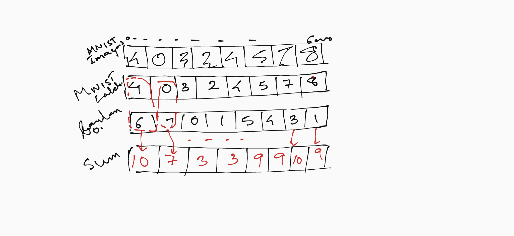
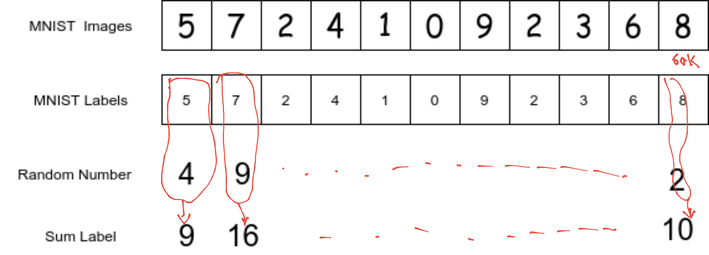
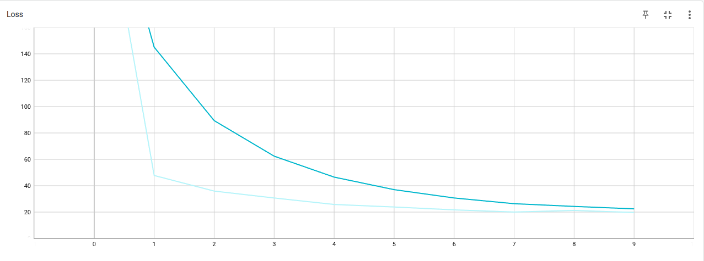
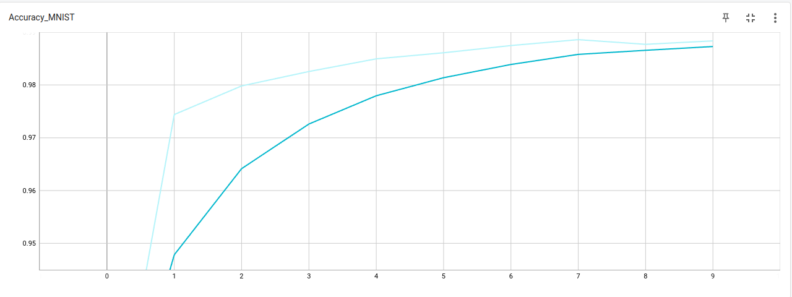
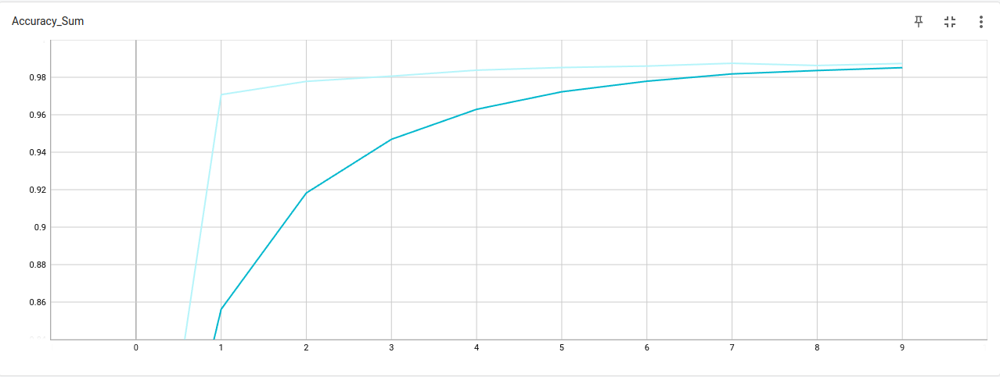

## Problem Statement
This is the assignment based on the Session on Pytorch learning

This problem requires to create a network which can take two types of input

MNIST image
A random Number from 0-9
and then give out two outputs

MNIST label corresponding to the input image
Sum of input random number  and MNIST label which we call __Sum Label__
e.g if MNIST image is 5 and input random number is 6 then the output will be 5 & 11

Essentially there are 4 major parts to this problem
1. __Network Architecture__: This will formulate the above problem statement into code. 
2. __DataSet Creation__: In order for the network to work properly i.e. give out the desired kind of the result, we need to pass the data in a proper format and also create a ground truth for the trainign to happen

3. __Choice of Loss Function__: This will determine if the training is happening properly or not. The choice of loss function is critical for the network to get trained. Loss function essentially  calculates the error which over the course of the training is reduced to as minimal as possible.

4. __Evalutaion__ : The network needs to be tested with a validation set or the data which the netwok has never seen so that we can determine if the network is overfitted or generalized. If the network gives very bad result on the test data but very good result on the training data then it implies that the network is overfitted.


**Note: For all the above key aspects of the problem we have written detailed analysis/notes in the jupyter notebook itself.**


### Datacreation Approaches
we want to mention that we experimented with two approaches to generate the data. The output is almost the same so cant decide which is better. Hence we have submitted both the notebooks for your reference. [Approach1](https://github.com/TSAI-END3-Group/Pytorch_Assignment/blob/master/notebooks/pytorch_assignment_solution_Approach1.ipynb)

[Approach2](https://github.com/TSAI-END3-Group/Pytorch_Assignment/blob/master/notebooks/pytorch_assignment_solution_Approach2.ipynb)

Broadly the two approaches are as follows

__Approach1:__ The dataset ```_init_``` function will generate MNIST images, MNIST labels, Random Numbers, Sum Lables and the ```_getItem__``` function will just pull out all the 4 datapoints at the given index as an arrayLookup




__Approach2:__ The dataset ```_init_``` function will only generate MNIST images & MNIST labels. The Random Numbers & Sum Lables will be genreated on demand in the ```_getItem__``` function 




## Results:
The **training accuracy** is 98% for detecting the MNIST images and 97% for detecting the correct Sum Labels after 10 epochs

Below are the curves that we get from TensorBoard
#### Loss curve


#### Accuracy for detecting MNIST 


#### Accuracy for detecting Sum Labels


The **testing accuracy** is ~97% for both MNIST images and Sum Labels

